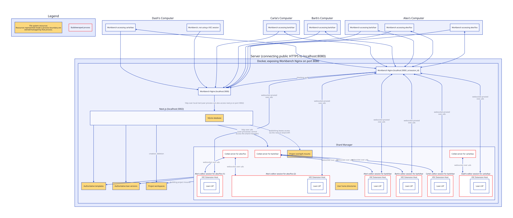

# Development

This document is meant for people developing the Lean workbench.
It describes how to locally run and test the workbench software.

## Prerequisites

- Docker installed and running,
  with at least 16GB memory allocated
  (in Docker Desktop, go to Settings -> Resources -> Memory).
- Node v24 or later is needed for `make container` to work

## Running the workbench server

```bash
npm clean-install # install dependencies and generate types
make dev # build and run the container in development mode
```

Open `http://localhost:3000`. You'll see the setup page.

1. - **Skip the OAuth section** — it's optional in dev mode.
     This is the fastest way to get a running instance.
     The UI forces you to put *something* for "Client ID" and "Client Secret",
     but if you put in something invalid (and then "Save Configuration")
     the only consequence is that GitHub OAuth won't work.
   - **Or** [create a GitHub OAuth App](https://github.com/settings/developers)
     with callback URL `http://localhost:3000/api/auth/github/callback`.
     Enter the resulting credentials on the setup page.
2. Click **Start Setup** to seed the data volume (downloads Mathlib,
   takes 5--30 min on first run).
3. When seeding finishes, you're redirected to the landing page.

### Sandboxed development

Development can be done inside of Docker Sandbox (which lets one avoid installing Docker Desktop on OSX).
The following commands inside the `lean-workbench` directory will create a virtual machine
and allow sufficient network access:

```
sbx create shell --name workbench .
sbx policy allow network --sandbox workbench '*.docker.com:443,production.cloudfront.docker.com:443,*.docker.io:443,openvsx.eclipsecontent.org:443,electronjs.org:443,*.electronjs.org:443,fonts.googleapis.com:443,github-cloud.githubusercontent.com:443,raw.githubusercontent.com:443,release-assets.githubusercontent.com:443,github.com:443,*.github.com:443,fonts.gstatic.com:443,*.lean-lang.org:443,playwright.download.prss.microsoft.com:443,nodejs.org:443,*.nodejs.com:443,deb.nodesource.com:443,*.npmjs.org:443,open-vsx.org:443,*.playwright.dev:443,checkpoint.prisma.io:443,binaries.prisma.sh:443,www.schemastore.org:443,ports.ubuntu.com:80,ports.ubuntu.com:443,lakecache.blob.core.windows.net:443'
```

The sandbox can be started by running

```
sbx run --name workbench
```

Before running the usual dev setup, you'll need to run the following commands *inside* the sandbox.
The `WORKBENCH_PUBLISH_IP` setting is necessary to access workbench outside the sandbox,
and the `DOCKER_CACHE_DIR` ensures that the docker cache doesn't have to cross the an inefficient VM boundary.

```
echo 'export WORKBENCH_PUBLISH_IP=0.0.0.0' >> ~/.bashrc
echo 'export DOCKER_CACHE_DIR=lean-workbench-cache' >> ~/.bashrc
source ~/.bashrc
```

To access the sandboxed website from your computer,
you'll also need to run the following command *outside* the sandbox.

```
sbx ports workbench --publish 43000:3000
```

After running the makefile targets insidethe sandbox (i.e. `make dev`),
the sandboxed server will be available on the host machine at <http://localhost:43000>

Hot module reloading won't work correctly if you're making edits outside of the VM.
Run `node scripts/hmr-nudge.mjs` in a separate `sbx` session
in order to get hot module reloading working correctly.

## Makefile targets

| Target | What it does |
|--------|-------------|
| `make` or `make container` | Build the production-mode Docker image |
| `make serve` | Start a production-mode container |
| `make enter` | Shell into a fresh production-mode container (for debugging) |
| `make container-dev` | Build the development-mode Docker image |
| `make dev` | Start a development-mode container with the host source code mounted for HMR |
| `make test` | Run tests |

During development,
workbench data is stored in the named Docker volume `lean-workbench-data` by default.
Set the `WORKBENCH_ROOT` Makefile argument to customize this.
When developing on MacOS or Windows,
it is recommended to use a named Docker volume instead of mounting a host directory.
This is because containers run in Linux VMs,
where virtual filesystems such as virtiofs cause degraded disk IO performance
and might not support overlayfs.

## Debugging

In dev mode (`make dev`),
the first VSCode server to start up will have its [extension host](https://code.visualstudio.com/api/advanced-topics/extension-host)
start a debugger on port 9229.
Use the "Attach to vscode-workbench" VSCode launch target to attach.
You can set breakpoints in the `vscode-workbench/` extension.
Note that `console.log` in the extension goes to the _renderer_, i.e., the web client.

## Resetting the data volume

The data volume is preserved on the host across development sessions,
so you don't need to re-run the setup/seeding step unless you wipe it.

To start completely fresh (wipe all projects, database, seeded packages):

```bash
make clean
```

## Architecture



Three processes run inside the Docker container:

1. **nginx** (background) — reverse proxy on port 3000.
   Routes VS Code WebSocket/HTTP traffic to per-session code-server instances.
   Everything else goes to the Next.js server.

2. **Next.js server** (background) — Next.js app on port 3002.
   Handles authentication, project CRUD API, the setup UI,
   and spawning code-server processes inside bwrap sandboxes.

3. **code-server** (one per active editing session) — spawned on demand by Next.js when a user opens a project.
   Each runs inside its own bwrap sandbox on a dynamically allocated port (3010, 3011, ...).

### Key paths

| Path | Purpose |
|------|---------|
| `src/instrumentation.ts` | Runs once at startup to initialize the Next.js server |
| `src/prisma/migrations/` | Numbered SQL migration files, run in order at server startup |
| `nginx.conf.template` | Reverse proxy config with dynamic per-session includes |
| `start.sh` | Container entrypoint: starts app + nginx |
| `scripts/seed-volume.sh` | First-run data volume setup (elan, Mathlib, templates) |
| `install.sh` | End-user installer (generates Docker Compose files) |

## Data volume layout

All persistent state lives under the `/data` directory inside the container.
Default: `lean-workbench-data` (named Docker volume) for `make dev`/`make serve`,
and `~/.lean-workbench/data/` (directory on host system) for `install.sh` deployments.

```
/data/
  db/
    lean-workbench.db           SQLite database (users, projects, auth config)

  elan/                         Lean version manager (shared across all sessions)
    bin/elan, bin/lean
    toolchains/
      leanprover--lean4---v4.X.Y/

  package-sets/                 Pre-built shared dependencies (admin-managed)
    mathlib-v4.X.Y/
      mathlib/                  Source + compiled .oleans
      batteries/
      packages.txt              List of included packages

  templates/                    Project templates (discovered at runtime)
    hello/
      metadata.json             { "name": "Hello World", ... }
      lean-toolchain
      lakefile.toml
      Main.lean
    mathlib-v4.X.Y/
      metadata.json             { "name": "Lean + Mathlib", "packageSet": "mathlib-v4.X.Y" }
      lean-toolchain
      lakefile.toml
      lake-manifest.json
      Main.lean

  workspaces/                   Per-user project files
    alice/
      vscode-remote/            VSCode server state and configuration
      <project-uuid>/
        lean-toolchain
        lakefile.toml
        Main.lean
        .lake/packages/         Overlaid from shared package-sets
        .lake/build/            User's own build artifacts
```

---

## Security considerations

Docker is used for convenience of deployment, not principally as a security boundary.
Bubblewrap is the mechanism by which we isolate users from one another.
Each user session runs in a `bwrap` sandbox with:

- **User namespace isolation** (`--unshare-user`, `--unshare-pid`,
  `--unshare-uts`, `--unshare-cgroup`). UID/GID are remapped to
  1000 inside the sandbox.
- **Read-only system mounts** (`/usr`, `/lib`, `/bin`, `/etc`).
- **Read-only Lean toolchain** (elan mounted at `/workspace/.elan`).
- **Copy-on-write overlays** for shared packages (`--tmp-overlay`).
  Reads come from admin-managed package-set directories; writes go to
  an ephemeral tmpfs layer. Package-set files are root-owned on the
  host for overlayfs copy-up to work correctly inside the user
  namespace.
- **Writable workspace** for the user's project files.
- Network is **not** currently isolated (`code-server` needs internet access)

The Docker container runs with `--cap-add SYS_ADMIN` and relaxed seccomp/apparmor settings
because bwrap needs these capabilities to create user namespaces and overlay mounts.

## Releases
Pushing a Git tag matching `v*` (e.g. `v0.1.0`) triggers the
[release workflow](.github/workflows/release.yml), which runs the
test suite and then builds and pushes a Docker image to
`ghcr.io/leanprover/lean-workbench` with semver-derived tags.
